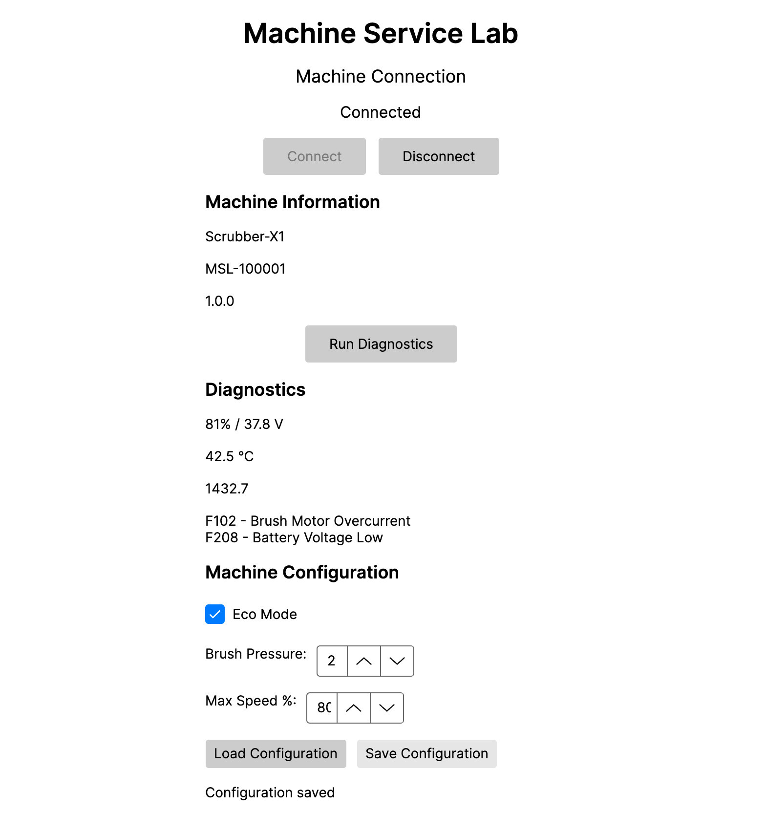
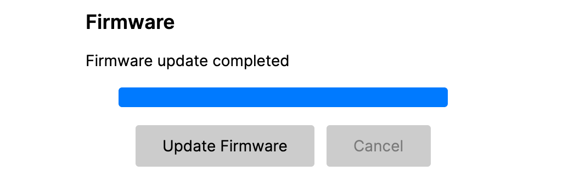
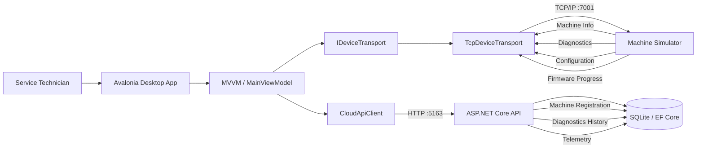

# Machine Service Lab

A connected-equipment diagnostics and service platform built with **.NET 10**, **Avalonia UI**, **ASP.NET Core**, **TCP/IP**, **Entity Framework Core**, and **SQLite**.

Machine Service Lab demonstrates how a traditional desktop diagnostics application can evolve into a modern connected-device architecture while preserving a clean separation between the user interface, device communication, cloud services, and persistence.

The project models realistic industrial service workflows including machine discovery, diagnostics, configuration, firmware programming, telemetry collection, and cloud registration.

---
## Inspiration

This project was inspired by the types of connected equipment service and diagnostics workflows publicly described by **Tennant Company**, including desktop based machine diagnostics, configuration, firmware/service workflows, telemetry, and the evolution toward network-connected equipment.

Machine Service Lab is an independent learning and architecture project. It is **not affiliated with, endorsed by, or derived from Tennant Company's proprietary software, source code, internal architecture, or device protocols**. All machine models, commands, telemetry values, fault codes, and communication protocols in this repository are simulated and created specifically for engineering practice.

---
## Application




## Architecture



### Device path

```text
Desktop UI
    ↓
MainViewModel
    ↓
IDeviceTransport
    ↓
TcpDeviceTransport
    ↓
TCP/IP
    ↓
Machine Simulator
```

### Cloud path

```text
Desktop UI
    ↓
MainViewModel
    ↓
CloudApiClient
    ↓
ASP.NET Core API
    ↓
Entity Framework Core
    ↓
SQLite
```

The ViewModel depends on the `IDeviceTransport` abstraction rather than a specific communication mechanism. This allows device communication to evolve independently from the desktop UI—for example from local USB/HID-style communication to TCP/IP-connected equipment.

---

## Current Features

### Machine Connection

* Connect to an industrial machine over TCP/IP
* Read machine model
* Read serial number
* Read firmware version
* Disconnect and reset application state
* Prevent device operations while disconnected

### Diagnostics

* Battery percentage
* Battery voltage
* Controller temperature
* Machine operating hours
* Fault-code retrieval
* Diagnostics history uploaded to the backend

Example simulated faults:

```text
F102 - Brush Motor Overcurrent
F208 - Battery Voltage Low
```

### Machine Configuration

Service technicians can retrieve and modify machine configuration.

Current configuration includes:

* Eco Mode
* Brush Pressure Level
* Maximum Speed %

Configuration changes are sent to the connected machine and can be retrieved again from the device.

### Firmware Programming

The desktop client supports a simulated firmware-programming workflow including:

```text
Ready
  ↓
Programming
  ↓
Progress 10% ... 100%
  ↓
Completed
```

Firmware updates support:

* asynchronous execution
* progress reporting
* cancellation
* connection validation
* failure handling
* firmware-version refresh after completion

### Telemetry

Diagnostics produce telemetry measurements that are uploaded independently to the backend.

Current telemetry includes:

* battery voltage
* controller temperature
* machine hours

Telemetry is persisted and can be queried by machine serial number.

### Cloud Registration

When a technician connects to a machine, the desktop client registers it with the backend.

Stored machine information includes:

* serial number
* model
* firmware version
* registration timestamp

---

## Solution Structure

```text
MachineServiceLab
│
├── src
│   │
│   ├── MachineServiceLab.Desktop
│   │   │
│   │   ├── Models
│   │   ├── Services
│   │   │   ├── CloudApiClient
│   │   │   ├── IDeviceTransport
│   │   │   ├── SimulatedDeviceTransport
│   │   │   └── TcpDeviceTransport
│   │   │
│   │   ├── ViewModels
│   │   └── Views
│   │
│   ├── MachineServiceLab.Api
│   │   │
│   │   ├── Data
│   │   └── Migrations
│   │
│   └── MachineServiceLab.DeviceSimulator
│
└── MachineServiceLab.slnx
```

---

## Technology Stack

| Area                 | Technology                             |
| -------------------- | -------------------------------------- |
| Runtime              | .NET 10                                |
| Language             | C#                                     |
| Desktop              | Avalonia UI                            |
| UI Pattern           | MVVM                                   |
| MVVM Toolkit         | CommunityToolkit.Mvvm                  |
| Device Communication | TCP/IP                                 |
| Backend              | ASP.NET Core Minimal API               |
| Data Access          | Entity Framework Core                  |
| Database             | SQLite                                 |
| Serialization        | JSON                                   |
| Device Protocol      | TCP line-based command protocol        |
| Async Processing     | Task / async-await / CancellationToken |

---

## Device Protocol

The simulated machine exposes a simple command protocol over TCP port `7001`.

Examples:

```text
INFO
DIAGNOSTICS
GET_CONFIG
SET_CONFIG|true|3|80
FIRMWARE
DISCONNECT
```

Example machine-information response:

```text
INFO|Scrubber-X1|MSL-100001|1.0.0
```

Example diagnostics response:

```text
DIAGNOSTICS|81|37.8|42.5|1432.7|F102 - Brush Motor Overcurrent;F208 - Battery Voltage Low
```

Firmware programming streams progress messages:

```text
PROGRESS|10
PROGRESS|20
PROGRESS|30
...
PROGRESS|100
FIRMWARE_COMPLETE|1.1.0
```

---

## Running the Project

Three processes are used during local development.

### 1. Start the machine simulator

```bash
dotnet run --project src/MachineServiceLab.DeviceSimulator
```

The simulator listens on:

```text
localhost:7001
```

### 2. Start the cloud API

Open another terminal:

```bash
dotnet run --project src/MachineServiceLab.Api
```

The local API currently runs on:

```text
localhost:5163
```

### 3. Start the desktop application

Open a third terminal:

```bash
dotnet run --project src/MachineServiceLab.Desktop
```

Then:

1. Connect to the machine.
2. Run diagnostics.
3. Load or update configuration.
4. Run a firmware update.
5. Inspect diagnostics and telemetry persisted by the API.

---

## Design Decisions

### Transport abstraction

The desktop application does not communicate directly with TCP from the ViewModel.

Instead:

```text
MainViewModel
      ↓
IDeviceTransport
      ↓
TcpDeviceTransport
```

This keeps device protocol concerns outside the UI layer and provides a path for additional transports such as USB/HID, CAN, Bluetooth, or other network protocols.

### Asynchronous device I/O

Device communication uses asynchronous APIs so long-running operations do not block the desktop UI.

Firmware programming additionally uses:

* `CancellationToken`
* `IProgress<T>`
* asynchronous stream reads

### Separate device and cloud paths

Connecting to equipment and communicating with cloud services are independent responsibilities.

```text
Device communication → IDeviceTransport

Cloud communication  → CloudApiClient
```

A local equipment connection therefore does not dictate how machine data is stored or distributed to other applications.

### Incremental modernization

The architecture represents an incremental modernization path:

```text
Desktop + directly connected device
                 ↓
transport abstraction
                 ↓
network-connected equipment
                 ↓
cloud APIs and persistent telemetry
                 ↓
future browser/device-agnostic clients
```

The existing desktop workflow can continue operating while backend capabilities and network-connected device support evolve independently.

---

## Engineering Concepts Demonstrated

This project intentionally focuses on engineering problems common in connected industrial applications:

* desktop application architecture
* MVVM
* dependency boundaries
* device communication abstractions
* TCP/IP networking
* asynchronous I/O
* cancellation
* progress reporting
* connection lifecycle management
* firmware-update workflows
* device configuration
* diagnostics
* telemetry
* REST APIs
* relational persistence
* database migrations
* cloud/device separation
* incremental application modernization

---

## Roadmap

Planned enhancements:

* device disconnect and reconnect recovery
* TCP timeouts and retry policies
* protocol validation
* structured logging
* firmware integrity validation
* authentication and role-based access
* audit history
* cloud-hosted API
* browser-based service experience
* automated tests
* CI/CD pipeline
* monitoring and health diagnostics

---

## Project Purpose

Machine Service Lab is a learning and architecture project focused on **connected industrial equipment software**.

It does not implement or reproduce any proprietary equipment protocol. The machine, protocol, telemetry, configuration values, fault codes, and firmware workflows in this repository are simulated specifically for engineering practice.
