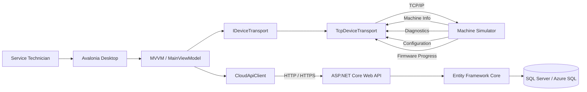
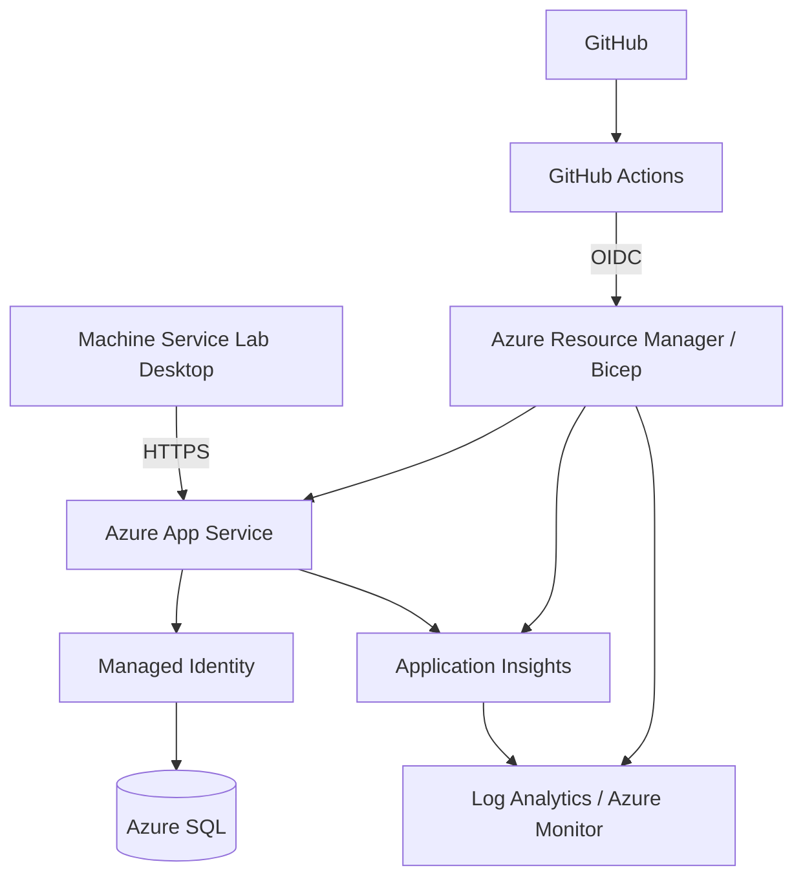

# Machine Service Lab

A connected equipment diagnostics and service platform built with **.NET 10**, **C#**, **Avalonia UI**, **ASP.NET Core Web API**, **TCP/IP**, **Entity Framework Core**, **SQL Server / Azure SQL**, and **Azure infrastructure as code**.

Machine Service Lab explores how a traditional desktop service and diagnostics application can evolve into a secure, cloud-connected architecture while preserving separation between the desktop UI, device communication, backend services, persistence, and observability.

The project models realistic industrial service workflows including machine discovery, diagnostics, configuration, firmware programming, telemetry collection, cloud registration, resilient device communication, and progressive Azure modernization.

---

## Inspiration

This project was inspired by the types of connected equipment service and diagnostics workflows publicly described by **Tennant Company**, including desktop based machine diagnostics, configuration, firmware/service workflows, telemetry, and the evolution toward network-connected equipment.

Machine Service Lab is an independent learning and architecture project. It is **not affiliated with, endorsed by, or derived from Tennant Company's proprietary software, source code, internal architecture, or device protocols**.

All machine models, commands, telemetry values, fault codes, and communication protocols in this repository are simulated and created specifically for engineering practice.

---

## Application


---

## Architecture



The architecture deliberately separates two independent communication paths:

```text
Device path

Desktop
   ↓
MainViewModel
   ↓
IDeviceTransport
   ↓
TcpDeviceTransport
   ↓
TCP/IP
   ↓
Connected Machine
```

```text
Cloud path

Desktop
   ↓
MainViewModel
   ↓
CloudApiClient
   ↓
ASP.NET Core Controllers
   ↓
Entity Framework Core
   ↓
SQL Server / Azure SQL
```

A device failure and a cloud failure are treated independently. Loss of cloud connectivity does not automatically imply loss of the physical machine connection.

---

## Azure Modernization Target



The Azure direction is intentionally based on production-oriented practices:

- infrastructure defined with **Bicep**
- deployment automation with **GitHub Actions**
- GitHub to Azure authentication through **OIDC**
- no Azure client secret committed to the repository
- **Azure App Service** for the ASP.NET Core backend
- **Azure SQL** for relational persistence
- **Managed Identity** for application to database authentication
- **Application Insights** and **Azure Monitor / Log Analytics**
- HTTPS only service communication
- environment based configuration
- database aware health checks

The existing Azure infrastructure is being adopted incrementally rather than recreated unnecessarily.

---

## Current Capabilities

### Machine Connection

The desktop application can connect to simulated industrial equipment over TCP/IP and retrieve:

- model
- serial number
- firmware version
- connection state

Connection failures, timeouts, unexpected disconnects, reconnect scenarios, and cleanup are handled independently of cloud connectivity.

### Diagnostics

The machine provides simulated diagnostic information including:

- battery percentage
- battery voltage
- controller temperature
- machine operating hours
- fault codes

Example faults:

```text
F102 - Brush Motor Overcurrent
F208 - Battery Voltage Low
```

Diagnostics can also be synchronized to the backend.

### Machine Configuration

Technicians can retrieve and update simulated machine configuration:

- Eco Mode
- Brush Pressure Level
- Maximum Speed %

Configuration communication remains behind `IDeviceTransport`; the ViewModel does not contain TCP protocol code.

### Firmware Programming

The desktop client implements an asynchronous firmware workflow with:

- progress reporting
- cancellation
- connection validation
- protocol validation
- error handling
- firmware version refresh
- non-blocking UI behavior

Example protocol flow:

```text
FIRMWARE
    ↓
PROGRESS|10
PROGRESS|20
...
PROGRESS|100
    ↓
FIRMWARE_COMPLETE|1.1.0
```

### Telemetry

Diagnostic data produces telemetry measurements such as:

- battery voltage
- controller temperature
- machine hours

Telemetry is sent independently to the ASP.NET Core backend and persisted through Entity Framework Core.

### Cloud Registration

When a machine connects, the desktop client can register:

- serial number
- model
- firmware version
- registration timestamp

A cloud registration failure does not disconnect a successfully connected machine.

---

## Backend API

The backend uses the modern ASP.NET Core hosting model with **controller-based Web APIs**.

```text
HTTP Request
     ↓
Request Contract
     ↓
ASP.NET Core Controller
     ↓
Entity Framework Core
     ↓
SQL Server / Azure SQL
     ↓
Response Contract
     ↓
HTTP Response
```

API contracts are separated from persistence entities.

Request validation is handled through ASP.NET Core `[ApiController]` behavior and data annotation validation.

Current API areas include:

```text
/api/machines
/api/diagnostics
/api/telemetry
/api/platform
/health
```

Read only EF Core queries use `AsNoTracking()` where appropriate and asynchronous database operations accept `CancellationToken`.

---

## Persistence

The project uses:

```text
Entity Framework Core
        ↓
SQL Server / Azure SQL
```

The relational model includes:

```text
Machine
   │
   ├── Diagnostics
   └── Telemetry
```

`SerialNumber` identifies the machine and diagnostics/telemetry records maintain database level foreign key relationships to it.

Indexes support the current machine history query patterns.

EF Core migrations are maintained for SQL Server rather than maintaining separate migrations for multiple database providers.

---

## Reliability

The project intentionally models failure scenarios common in connected industrial software.

### Device communication

`TcpDeviceTransport` includes:

- connection timeout
- asynchronous network I/O
- protocol response validation
- disconnect detection
- resource cleanup
- cancellation support
- reconnect capability

### Device versus cloud availability

Machine operations and cloud synchronization have separate failure boundaries.

```text
Machine unavailable
      ↓
Device connection state changes


Cloud unavailable
      ↓
Machine remains connected
Cloud synchronization reports failure
```

This prevents a backend outage from incorrectly representing a physically connected machine as disconnected.

---

## Observability

The ASP.NET Core API supports **Azure Monitor OpenTelemetry**.

When an Application Insights connection string is supplied by the Azure environment, the API enables Azure Monitor telemetry.

The API also exposes:

```text
/health
```

with an Entity Framework Core database health check.

---

## Infrastructure as Code

Azure monitoring infrastructure is defined under:

```text
infra/
├── main.bicep
└── parameters.bicepparam
```

The Bicep template defines workspace based monitoring resources:

```text
Log Analytics Workspace
        ↓
Application Insights
```

The core App Service and Azure SQL resources already exist and are being integrated into the reproducible infrastructure/deployment workflow incrementally.

---

## CI/CD

Infrastructure deployment is defined in:

```text
.github/workflows/deploy-infra.yml
```

The workflow uses GitHub Actions OpenID Connect:

```text
GitHub Actions
      │
      │ OIDC
      ▼
Microsoft Entra ID
      │
      ▼
Azure Resource Manager
      │
      ▼
Bicep deployment
```

No long lived Azure client secret is stored in the repository.

The infrastructure workflow is scoped to:

```text
rg-machine-service-lab
```

---

## Solution Structure

```text
MachineServiceLab/
│
├── .github/
│   └── workflows/
│       └── deploy-infra.yml
│
├── docs/
│   └── images/
│
├── infra/
│   ├── main.bicep
│   └── parameters.bicepparam
│
├── src/
│   │
│   ├── MachineServiceLab.Desktop/
│   │   ├── Models/
│   │   ├── Services/
│   │   │   ├── CloudApiClient.cs
│   │   │   ├── IDeviceTransport.cs
│   │   │   ├── SimulatedDeviceTransport.cs
│   │   │   └── TcpDeviceTransport.cs
│   │   ├── ViewModels/
│   │   └── Views/
│   │
│   ├── MachineServiceLab.Api/
│   │   ├── Contracts/
│   │   ├── Controllers/
│   │   ├── Data/
│   │   └── Migrations/
│   │
│   └── MachineServiceLab.DeviceSimulator/
│
├── MachineServiceLab.slnx
└── README.md
```

---

## Technology Stack

| Area | Technology |
|---|---|
| Runtime | .NET 10 |
| Language | C# |
| Desktop | Avalonia UI |
| Desktop Pattern | MVVM |
| MVVM Toolkit | CommunityToolkit.Mvvm |
| Device Communication | TCP/IP |
| Backend | ASP.NET Core Web API Controllers |
| API Contracts | Request / Response contracts |
| Validation | ASP.NET Core + Data Annotations |
| Data Access | Entity Framework Core 10 |
| Database | SQL Server / Azure SQL |
| Cloud Compute | Azure App Service |
| Infrastructure | Bicep |
| CI/CD | GitHub Actions |
| Cloud Authentication | GitHub OIDC / Microsoft Entra ID |
| Application Identity | Managed Identity target |
| Observability | OpenTelemetry / Application Insights / Azure Monitor |
| Async Processing | Task / async-await / CancellationToken |

---

## Device Protocol

The machine simulator exposes a deliberately simple line-based TCP protocol on port `7001`.

Commands include:

```text
INFO
DIAGNOSTICS
GET_CONFIG
SET_CONFIG|true|3|80
FIRMWARE
DISCONNECT
```

Example machine information:

```text
INFO|Scrubber-X1|MSL-100001|1.0.0
```

Example diagnostics:

```text
DIAGNOSTICS|81|37.8|42.5|1432.7|F102 - Brush Motor Overcurrent;F208 - Battery Voltage Low
```

This protocol is entirely simulated and is not based on a proprietary equipment protocol.

---

## Running the Device Workflow

Build the solution:

```bash
dotnet restore
dotnet build
```

Start the machine simulator:

```bash
dotnet run --project src/MachineServiceLab.DeviceSimulator
```

Start the desktop application:

```bash
dotnet run --project src/MachineServiceLab.Desktop
```

The simulator listens on:

```text
localhost:7001
```

The desktop API endpoint is environment configurable through:

```text
MACHINE_SERVICE_API_URL
```

and falls back to:

```text
http://localhost:5163
```

for development.

The API itself requires a SQL Server/Azure SQL connection through application configuration.

---

## Design Principles

### Dependency inversion

The ViewModel depends on:

```text
IDeviceTransport
```

rather than directly on TCP implementation details.

That allows another transport to be introduced without rewriting the desktop workflow.

### Separation of concerns

```text
Views
    ↓
ViewModels
    ↓
Device / Cloud services
```

TCP communication, cloud communication, presentation state, API contracts, and persistence remain separate concerns.

### API boundary

HTTP request/response contracts are separate from Entity Framework persistence entities.

### Cloud and device independence

A technician can remain connected to a physical machine even if cloud synchronization becomes unavailable.

### Incremental modernization

```text
Desktop + local device
        ↓
transport abstraction
        ↓
TCP/IP-connected equipment
        ↓
cloud API
        ↓
Azure SQL + observability
        ↓
secure browser/device-agnostic experiences
```

---

## Engineering Concepts Demonstrated

- modern C# and .NET
- desktop MVVM architecture
- SOLID-oriented dependency boundaries
- asynchronous programming
- cancellation
- TCP/IP networking
- device protocol handling
- failure recovery
- firmware workflows
- REST APIs
- controller-based ASP.NET Core
- API contract validation
- relational database design
- Entity Framework Core
- SQL Server / Azure SQL
- database migrations
- health checks
- OpenTelemetry
- Azure infrastructure as code
- GitHub Actions
- OIDC-based cloud deployment
- cloud/device failure isolation

---

## Next Modernization Steps

The remaining cloud work focuses on:

```text
Existing App Service
      ↓
Managed Identity
      ↓
Azure SQL

App Service
      ↓
Application Insights
      ↓
Azure Monitor / Log Analytics
```

Additional planned work includes Azure IoT integration, Microsoft Entra API authentication, role based access, firmware integrity validation, automated tests, and a browser based service experience.

---

## Project Purpose

Machine Service Lab is a learning and architecture project focused on **connected industrial equipment software and incremental cloud modernization**.

It does not implement, reproduce, or claim knowledge of Tennant Company's proprietary software architecture, source code, or equipment protocols.